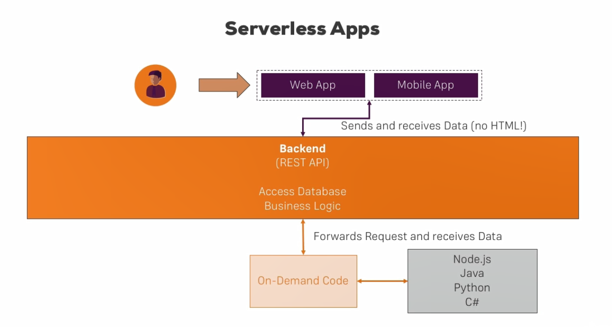
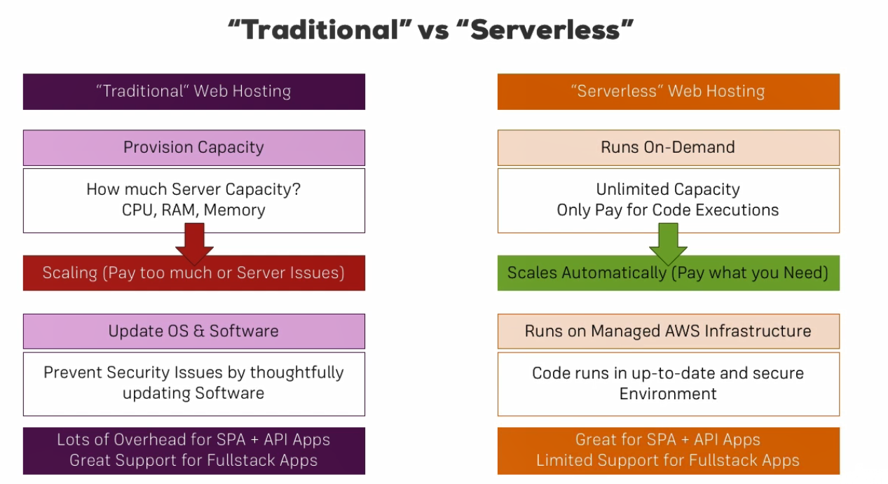
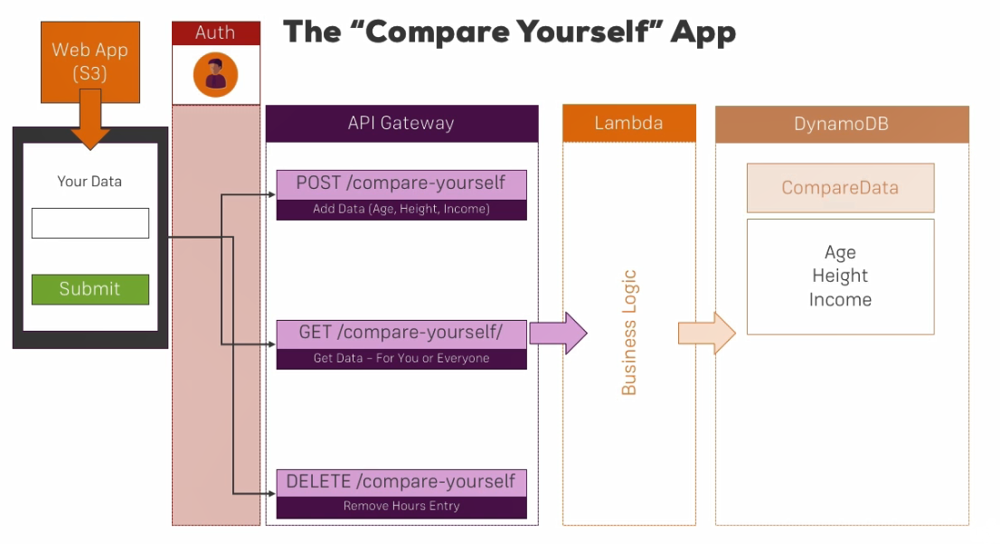
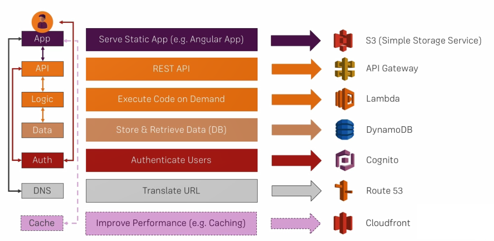
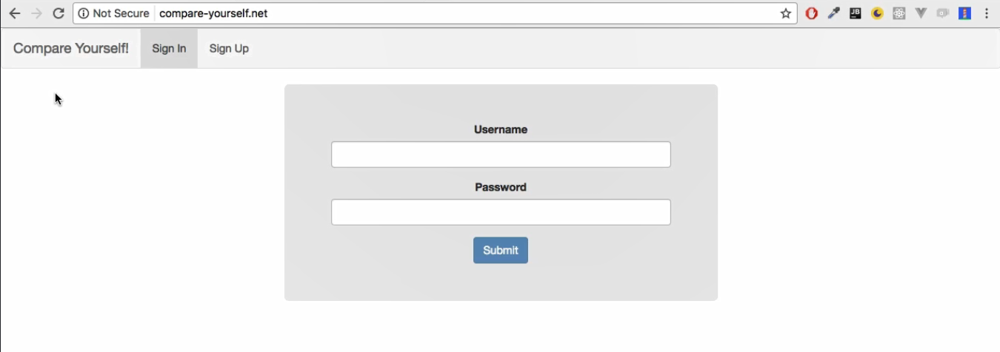
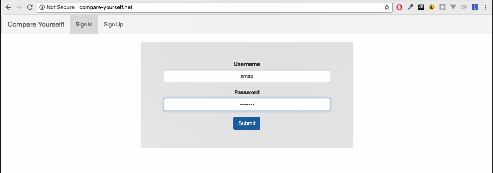
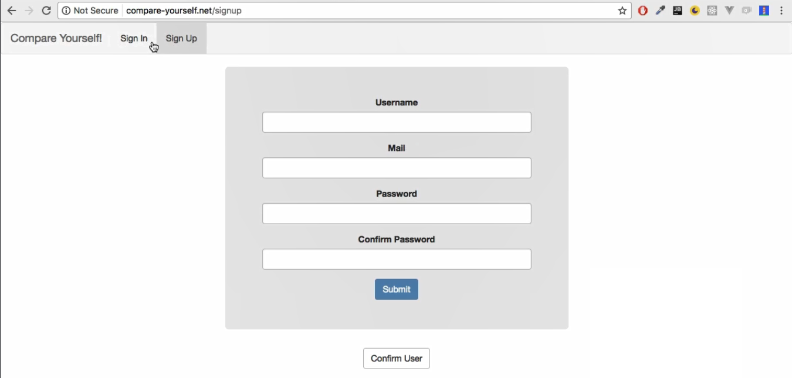
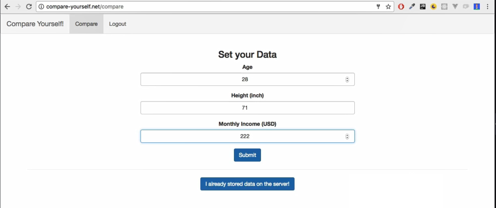
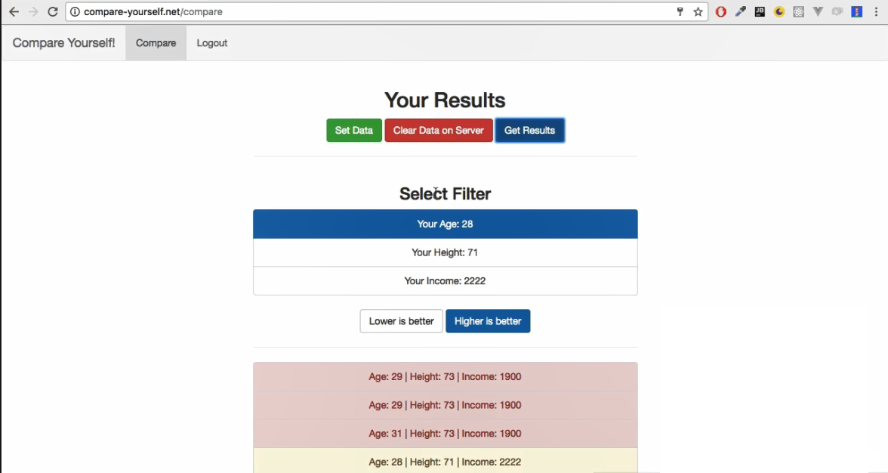

# ServerlessApp-CompareYourself
Web Application to Compare your details using Serverless Architecture on AWS 

## Goal
* The goal is to build a scalable web application which uses Serverless Architecture of AWS like S3,API Gateway, Lambda, DynamoDB, Cognito, Route 53, CloudFront etc.

## System Design




### Technology stack



<table>
<thead>
<tr>
<th>Area</th>
<th>Technology</th>
</tr>
</thead>
<tbody>
	<tr>
		<td>Front-End</td>
		<td>Angular, HTML5, CSS3, Bootstrap, TypeScript</td>
	</tr>
  	<tr>
		<td>REST API & Server-Side</td>
		<td>API Gateway, Lambda </td>
	</tr>
  </tr>
 <tr>
		<td>Authenticate users</td>
		<td>Cognito</td>
	</tr>
   </tr>
  	<tr>
		<td>Images & Assets Storage</td>
		<td>S3</td>
	</tr>
  <tr>
		<td>Database</td>
		<td>DynamoDB</td>
	</tr>
  <tr>
		<td>Routing</td>
		<td>Route 53</td>
	</tr>
	 	<tr>
		<td>Caching</td>
		<td>CloudFront</td>
	</tr>
</tbody>
</table>

## Screenshots

##### HomePage

##### Sign in

##### Sign Up

##### Compare Details

##### Results


## Steps for Project Execution :
```
cd ServerlessApp-CompareYourself
npm install
ng serve -o
```
